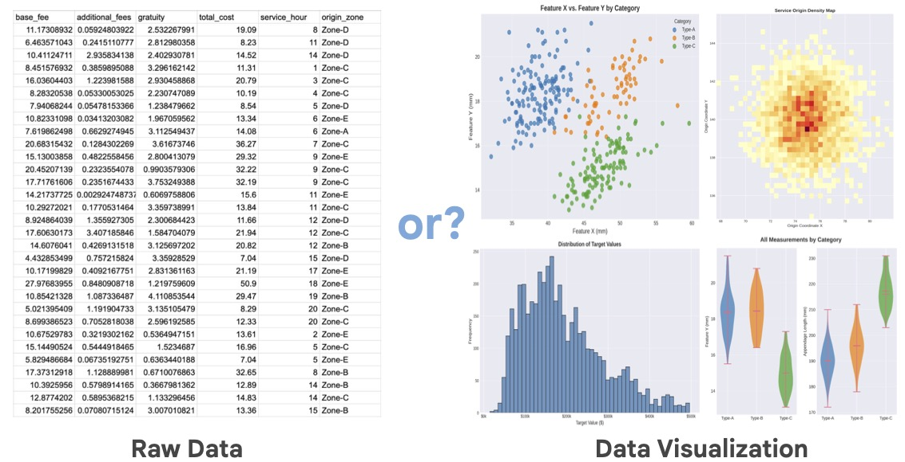

Humans benefit greatly from visualizing data. Do AI models benefit from visualizations too, or can they just take in raw data and make sense of it? This is an informal study with [Claude](https://claude.ai/) to answer this question.

We created ~120 questions about 3 datasets and asked GPT-4.1 model to answer them either based on raw dataset as text (in csv format) or based on an appropriate visualization as an image.

As the dataset size grows, the model becomes less accurate when answering from raw dataset text:

So from this experiment **it does seem that currently AI benefits from data visualization.**

The model's accuracy when working from visualizations isn't perfect, but that's not the main point - all these questions are easily answerable from the images, and models will likely improve at chart reading over time. What's more interesting is how much performance drops with raw data.

You can see all the questions and visualizations here:
<iframe
  src="https://huggingface.co/datasets/imordatch/csv_vs_viz/embed/viewer/default/train"
  frameborder="0"
  width="100%"
  height="560px"
></iframe>

### Why does this happen?
It seems the model cannot aggregate or pinpoint data in large contexts. Often the model ties to write out a few sampled dataset rows and answer based on those (usually incorrectly). The situation would probably be different if the models could run analysis code to answer questions. But this is concerning - if the data fits in the model’s context, shouldn’t it be able to see the big picture without writing code? That it can’t form a holistic understanding of the data it can fully "see" suggests limitations in how models process tabular information.

### Why does it matter? A few consequences:
* Be careful when passing large raw datasets to the models. Even when data fits within context limits, models seem to struggle to make sense of the datasets beyond a few hundred rows.
* Consider visualizing data before passing it to your model and have AI agents communicate via visualizations rather than raw data.
* If AI agents communicate in visualizations (at least in part), there is hope that humans will be able to understand that communication.
* We should put more effort into chat/visualization understanding in our models (it’s definitely not perfect right now), and in parallel into improving large raw data understanding (without exclusively relying on tool use) to eventually let the data speak for itself.

### Some caveats
* The model did not use tools (particularly statistical tools) or other more involved agentic processes. It’s very likely the models would do better working from csv in this case. But I was interested in seeing if data interpretation can be a successful “atomic” operation for the models.
* We only used GPT-4.1 model in this experiment - it’s possible other models would give different results and I’m curious to try them, but GPT is a good representative of frontier AI models.
* We subsampled medium and large datasets to fit csv text into the model’s 150K token context - so medium and large datasets are actually clipped to the same token count, but I still suspect the large dataset has more diversity.
* There are still too many specific questions - I would love to include more open-ended questions about data interpretation which better reflect how we work with data.
* While we tried to obfuscate the datasets, the model did sometimes guess at the underlying dataset and make inferences based on that.

### Process and acknowledgements
This was a really fun informal project to do with Claude! Using Claude made the whole process much faster - it suggested datasets, questions, all the code, and helped with writing of this post. I provided high level steering and oversight (and caught a few issues along the way). It’s been especially helpful to do the entire project in a single chat session, because Claude would have all the context on what has been done. If you’re interested in details of this process, you can view the [complete Claude transcript for this project](https://claude.ai/share/ca4da6ab-189a-43ae-8a5b-0de33013542a).

What could have taken 3 months as a summer undergraduate research project was done over a few scattered weekends and having all the context made it a lot easier to jump back in when doing work in short bursts. I look forward to looking into more AI research questions this way!

I am also grateful to [Marti Hearst](https://people.ischool.berkeley.edu/~hearst/) and [Bowen Baker](https://bowenbaker.github.io/) for giving feedback on this post.

### Experiment details and data
Claude suggested we use the following three datasets of increasing size:
* [Palmer Penguins](https://allisonhorst.github.io/palmerpenguins/) (350 rows): A small dataset about Antarctic penguin measurements
* [California Housing](https://scikit-learn.org/stable/datasets/real_world.html#california-housing-dataset) (20,640 rows): A medium-sized dataset with housing prices and geographic data
* [NYC Taxi Trips](https://www.nyc.gov/site/tlc/about/tlc-trip-record-data.page) (50,000 rows sampled): A large dataset tracking taxi rides across New York City
To prevent the model from using prior knowledge about these popular datasets, we obfuscated all datasets - renaming columns, transforming values, and using generic labels.

The visualizations used standard data science plots: line plots, scatter plots, box plots, heatmaps, bar charts, and histograms. Claude wrote visualization code and generated approximately 40 questions per dataset — a mix of specific queries (_"Which category has the highest median value?"_) and open-ended analysis (_"What patterns do you observe in the geographic distribution?"_). Then I personally evaluated all ~120 model responses for each condition (autorating responses would likely have been possible, but I was being conservative).

Again, you can [access the full dataset on huggingface](https://huggingface.co/datasets/imordatch/csv_vs_viz/) and re-try this experiment yourself.
